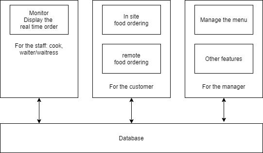
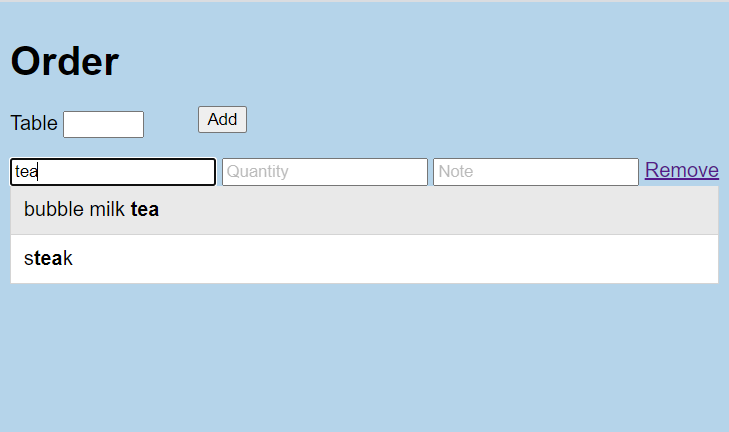

# FOOD ORDER SYSTEM
## Introduction
An application that helps restaurants to manage food ordering. It is inspired by my experience of work in restaurants.
 

In current stage, there are three main features
### 1. manage the memu
The manager can add, delete, update, select the foods information, such as name, price, details, etc.

### 2. order foods
The customers can order foods in a webpage. The food names can be auto-completed to ease the processes.   
The current interface looks like: 

The food order information will be stored in the database after confirmation.

### 3. display orders
Display the real time order information, so that the cook and other kitchen staff will know what to prepare.

